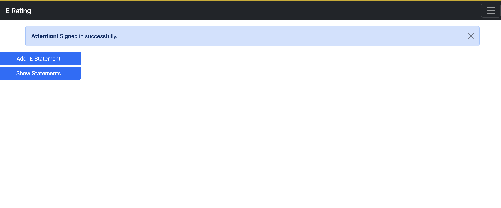
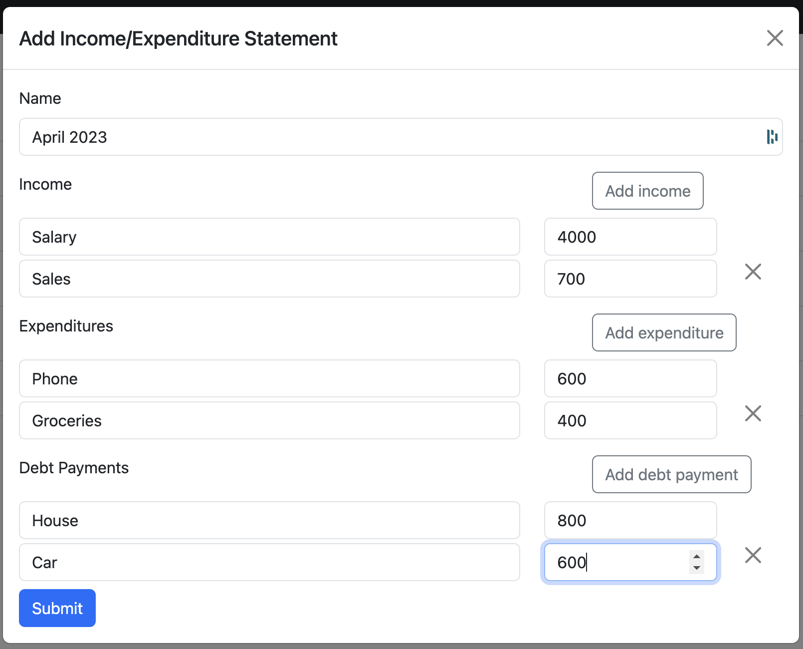
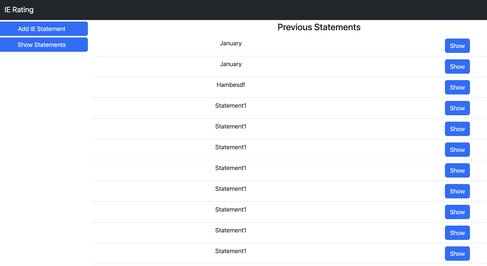

# IE Rating App
This app allows registered users to add Income/Expenditure statements. After adding, the app will display the Disposable Income and IE Rating.

## Setup the app
- This app uses Ruby 3.2.1. Hence please install Ruby 3.2.1
- This app uses sqlite3. Hence make sure sqlite3 is installed on your computer
- Try `sqlite3 --veresion` on the terminal to check whether it exists.
- `bundler` gem needs to be installed in your computer. If it's not available issue `gem install bundler` on your terminal
- `npm` command should be available on the computer. Hence install Node.JS if it's not found
- `yarn` command is required. Hence install it if it's not found
- Open terminal and issue the command `git clone git@github.com:chamithlkml/ie-rating.git`
- `cd ie-rating`
- `bundle install`
- `npm install`
- `yarn install`
- `bundle exec rails db:migrate`
- `bundle exec rails server`
- Navigate to http://localhost:3000 of your browser
- This app uses `devise` auth module to sign up and sign in users. (Please note that styles are not applied to the `devise` generated views due to time constraints)
- Bootstrap was used to style the pages that were developed for this exercise.
- Go to http://localhost:3000/users/sign_up and sign up as a user. After sign up or sign in user will be navigated to home page at http://localhost:3000/

- Click on Add IE Statement button

- Click Submit and it will create the statement and produce the Disposable income and IE Rating

- Click on Show Statements button on left pane. It will show user's previous IE statements.

- Click on Show button of a chosen statement. It will show the statement with the Disposable income and IE Rating.

## Running tests
- `RAILS_ENV=test bundle exec rails db:migrate`
- `RAILS_ENV=test bundle exec rake db:fixtures:load` to load sample data. If the test fails due to sample data issue, pleases re-issue this command again
- `bundle exec rspec spec`

## Thought process

- Assumed description and amount are common for income, expenditure, debt_payments I used a single table statement_entries table with `entry_type` column being used to identify the difference for simplicity.

- But if the app is going to scale up with more data related to income, expenditure or debt_payments these entries need to be stored in separate tables.

## Potential improvements

- Implementing the app using Vue.JS as it helps dev speed due to increased code reusage.(I didn't use it for this exercises due to the need of `devise` ui files)
- Implement end-to-end tests using `selenium` web driver or `cypress`